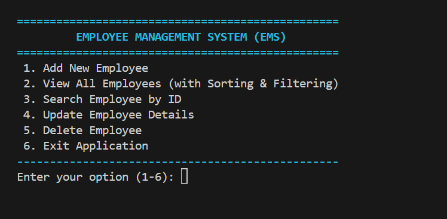
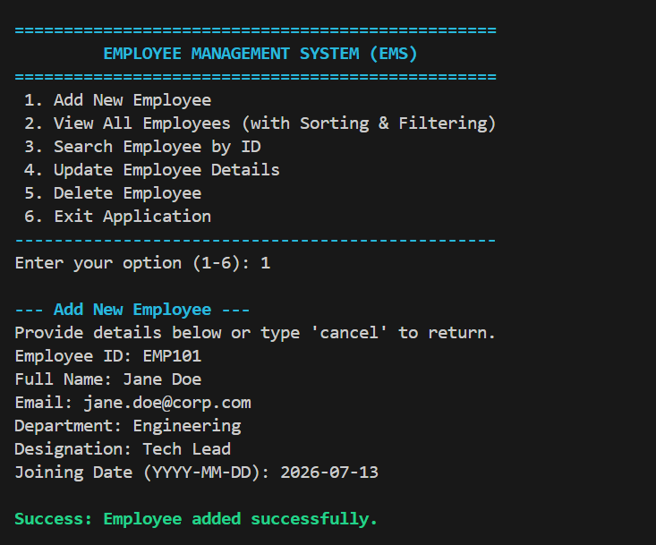
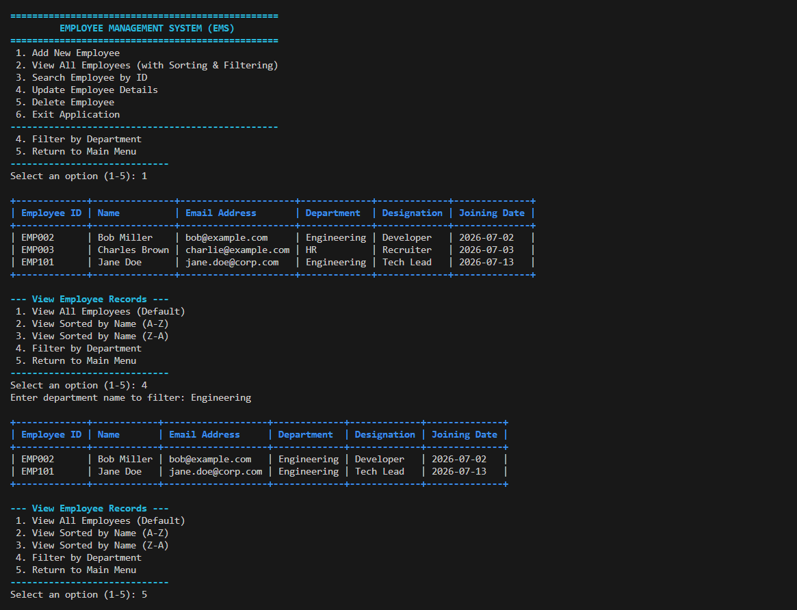
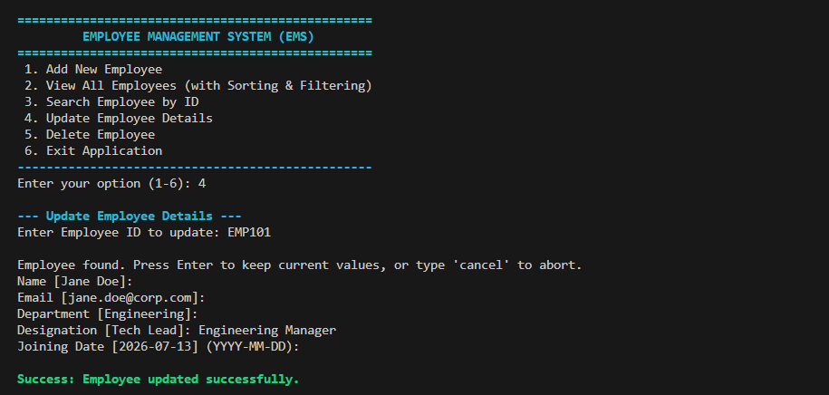
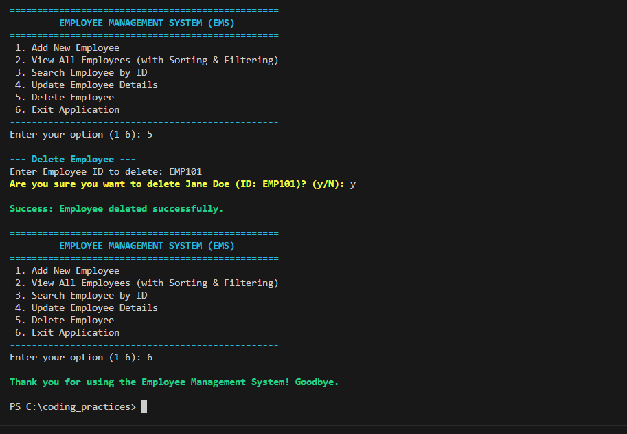

# Employee Management Console Application

A command-line based Employee Management System (EMS) written in Python, designed following clean code principles, architectural separation of concerns, and defensive error handling best practices.

---

## Architecture & System Design

The application follows a clean layered architecture with clear separation of concerns:

- **Data Models (`models/`)**: 
  - `Employee`: Encapsulates employee entity attributes, field validations (ID, name, email regex, date formats), and dictionary serialization.
  - `DatabaseError`, `CorruptDataError`, `StorageError`: Explicit domain exception hierarchy for persistence errors.
- **Persistence Layer (`repositories/`)**: 
  - `EmployeeRepository`: Abstract persistence interface.
  - `JSONEmployeeRepository`: Concrete file-based repository implementation managing atomic writes via temporary files, differentiating missing files (clean initialization) from corrupt JSON (explicit exception raising).
- **Service / Business Logic (`services/`)**: 
  - `EmployeeService`: Manages business rules, duplicate detection, search, sorting, filtering, and transactional state consistency (in-memory rollback on save failure).
- **User Interface (`ui/`)**: 
  - `EmployeeConsoleUI`: Modular presentation layer managing formatted ASCII tables, user input prompt loops, cancellation flows, and ANSI colored feedback.
- **Entry Point (`main.py`)**: 
  - Initializes dependencies, handles global application bootstrap errors, and drives the interactive menu loop.

---

## Features Implemented

### Core Features
- **Add Employee Details**: Prompts for Employee ID, Name, Email, Department, Designation, and Joining Date with real-time validation.
- **View All Employees**: Displays all employee records in an aligned ASCII table format.
- **Search Employee**: Case-insensitive search by Employee ID.
- **Update Details**: Update selective fields of an existing employee while keeping current values by pressing `Enter`.
- **Delete Employee**: Remove an employee record after a safety confirmation prompt.
- **Exit**: Exits the application cleanly.

### Robustness & Bonus Features
- **Sorting**: View employees sorted alphabetically by Name in Ascending (A-Z) or Descending (Z-A) order.
- **Filtering**: Filter and display employees belonging to a specific department.
- **Duplicate ID Prevention**: Pre-checks uniqueness to prevent duplicate registrations.
- **Defensive Error Handling**: Missing data files start cleanly as an empty database, while corrupt or unreadable files raise actionable integrity warnings rather than silently overwriting data.
- **State Consistency & Rollback**: If saving to disk fails during add, update, or delete operations, in-memory state is automatically rolled back to match storage.
- **Atomic File Writes**: File saves write to temporary staging files first before atomic replacement to prevent file truncation on unexpected crashes.
- **Unit Test Suite**: Full unit test coverage for models, business operations, corrupt data detection, and rollback safety.

---

## Best Practices Followed

1. **Meaningful Naming Conventions**: Clear, descriptive names across classes, methods, and variables.
2. **Single Responsibility Principle (SRP)**:
   - `Employee`: Data model & structural validation.
   - `JSONEmployeeRepository`: Serialization and atomic file I/O.
   - `EmployeeService`: Business rules and transactional memory management.
   - `EmployeeConsoleUI`: Presentation formatting and terminal interactions.
3. **DRY (Don't Repeat Yourself)**: Reusable input validation prompts and shared table formatters.
4. **Input Validation**:
   - **ID**: Checked for non-empty input and duplicate prevention.
   - **Name**: Checked for non-empty input.
   - **Email**: Verified using pre-compiled regular expressions (`_EMAIL_PATTERN`).
   - **Joining Date**: Enforced strict `YYYY-MM-DD` date parsing.
5. **Safe Error Handling**: Handles corrupt files, I/O exceptions, and `KeyboardInterrupt` (`Ctrl+C` or `EOFError`) without unhandled crashes.
6. **No Hardcoded Constants**: Colors and UI styling codes are defined as clean constants.

---

## Prerequisites & Installation

- **Python Version**: **Python 3.8+** (uses standard library modules: `json`, `re`, `datetime`, `typing`, `unittest`, `abc`, `os`, `sys`).
- **Dependencies**: None (pure Python standard library).

---

## How to Run the Application

### Run the App
From the root directory, execute:
```bash
python main.py
```

### Run the Unit Tests
To execute all validation, business logic, corrupt JSON handling, and rollback test cases:
```bash
python -m unittest discover -s tests -v
```

---

## Data Storage & Sample Seed Data

The application persists records to `employees.json` in the working directory.

To test the application with pre-existing sample data:
1. Create a file named `employees.json` in the root folder.
2. Add the following sample JSON array:
```json
[
    {
        "employee_id": "EMP001",
        "name": "Alice Smith",
        "email": "alice@example.com",
        "department": "Engineering",
        "designation": "Tech Lead",
        "joining_date": "2026-07-01"
    },
    {
        "employee_id": "EMP002",
        "name": "Bob Miller",
        "email": "bob@example.com",
        "department": "Engineering",
        "designation": "Developer",
        "joining_date": "2026-07-02"
    },
    {
        "employee_id": "EMP003",
        "name": "Charles Brown",
        "email": "charlie@example.com",
        "department": "HR",
        "designation": "Recruiter",
        "joining_date": "2026-07-03"
    }
]
```
3. Run `python main.py` to view and manage these records.

---

## Application Screenshots

### 1. Main Menu Screen
Shows the starting page and clean interface of the system:


### 2. Adding an Employee (with Validation Check)
Demonstrates input processing and successful validation:


### 3. Displaying and Sorting/Filtering Records
Shows the custom-formatted, auto-scaling data table, sorting, and department-filtering in action:


### 4. Search and Selective Update
Shows searching a record and updating specific fields while leaving others unchanged:


### 5. Deletion & Safety Confirmation
Shows the confirmation prompt before removing a record:

